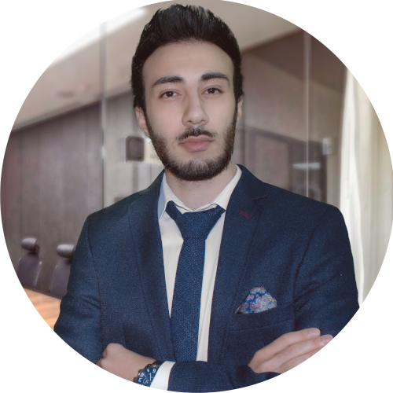

<h1 align="center" >Hello There,  I'm Yiğit Burak Akkaş</h1>

<h2>About Me</h2>
<!---

  --->

I am currently working as a `Machine Learning Engineer` at `Jotform`

I graduated from the `Computer Engineering` Department of the University of the Turkish Aeronautical Association.

I have `ranked` projects in different events and competitions.

I enjoy supporting and following `entrepreneurial` peoples and `innovative` project ideas.

 

<h2>⚙️ GitHub Analytics</h2>

  

  
  <!---
  
  --->

<h2>🔥 Some of My Projects</h2>

  
  
  
  
  
  
  
  

 

  

 

             ,\,\
             \\\/_
              \` ,\
         __,.-" =__)
       ."        )
    ,_/   ,    \/\__
    \_|__'   )_-\ \--`
         `-----` `--`
        𝔽𝕠𝕝𝕝𝕠𝕨 𝕥𝕙𝕖 𝕨𝕙𝕚𝕥𝕖 𝕣𝕒𝕓𝕓𝕚𝕥 ...

  

